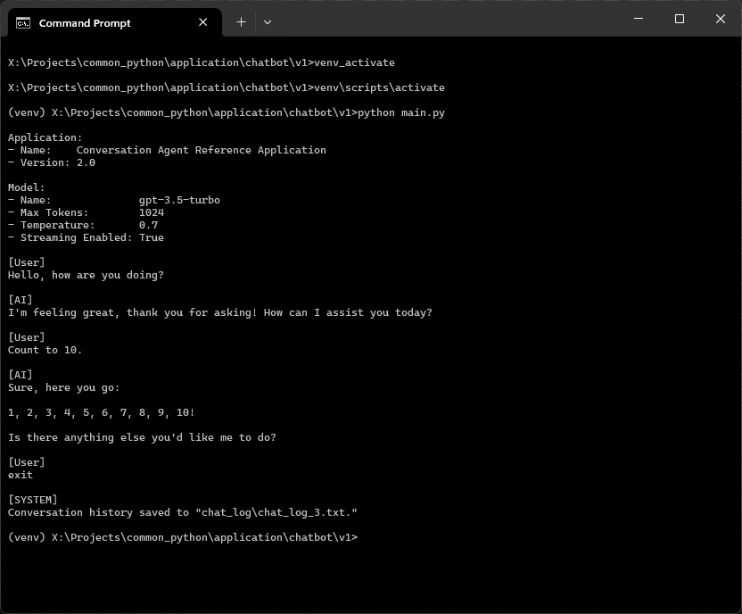
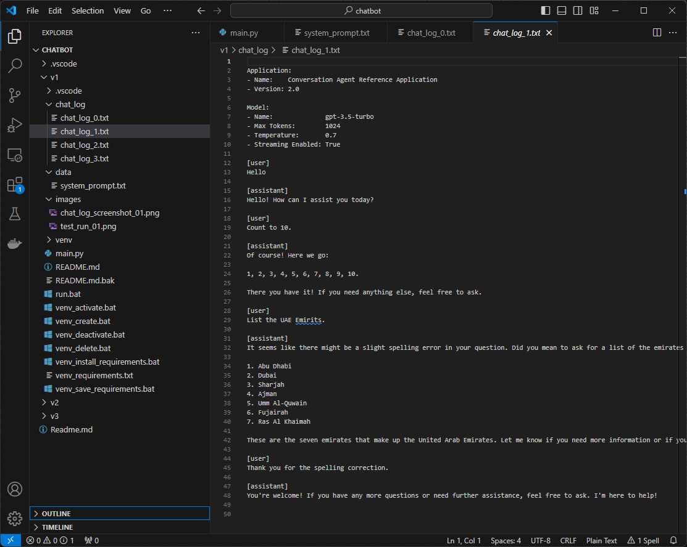

# OpenAI GPT Chatbot Reference Application
**Version:** 2.0 (OOP version)

General purpose OpenAI GPT API reference application, demonstrating the basic layout and features of an LLM-based ChatGPT with conversation history, user commands, and saving of chat log file.

## Table of Contents
3. [Features](#features)
2. [Installation](#installation)
3. [Usage](#usage)
4. [Features](#features)
5. [Contributing](#contributing)
6. [License](#license)
7. [Contact Information](#contact-information)
8. [Acknowledgements](#acknowledgements)

## Features
- Terminal hosted tern-based chatbot. 
- Conversation history maintained during a conversation.
- Terminal command manager.
- System prompt loaded from a text file. 
- Chat log saved to a text file.

## Usage

Activate the Python virtual environment, and then run the program with `python main.py`, or using the `run.bat` batch file. 



The chat log is saved to a text file after exiting the program.




## Installation

### Prerequisites

- Python 3.x
- OpenAI API
  
  - `pip install --upgrade openai`
  
    or

  - `pip install openai`

    or
    
  - use the `venv_install_requirements.bat` batch file, which will `pip install` the dependencies from the `venv_requirements.txt` file. 

### Clone repository

1. Clone the repository:
    ```sh
    git clone https://github.com/your-username/your-repo.git
    ```

2. Navigate to the project directory:
    ```sh
    cd your-repo
    ```

### Python Virtual Environment Setup

3. Create and activate the virtual environment using the provided batch files:

   If you are using Windows, for the sake of convenience, a set of `venv_*.bat` batch files is provided to create, manage, and maintain the Python virtual environment.

    - To create the virtual environment and activate it, run:
      ```sh
      venv_create.bat
      ```
    - If you need to activate the virtual environment later, run:
      ```sh
      venv_activate.bat
      ```
    - To deactivate the virtual environment, run:
      ```sh
      venv_deactivate.bat
      ```
    - To delete the virtual environment, run:
      ```sh
      venv_delete.bat
      ```

4. Install the required packages:
    ```sh
    venv_install_requirements.bat
    ```

5. To save the current list of installed packages to `venv_requirements.txt`, run:
    ```sh
    venv_save_requirements.bat
    ```
## Contributing
Contributions are welcome! Please follow the contribution guidelines.
1. Fork the project.
2. Create your feature branch (git checkout -b feature/AmazingFeature).
3. Commit your changes (git commit -m 'Add some AmazingFeature').
4. Push to the branch (git push origin feature/AmazingFeature).
5. Open a pull request.

## License
Distributed under the MIT License. See LICENSE for more information.

## Contact Information
- Twitter: [@rohingosling](https://x.com/rohingosling)
- Project Link: [https://github.com/rohingosling/OpenAI-GPT-Reference-Application-2-OOP](https://github.com/rohingosling/OpenAI-GPT-Reference-Application-2-OOP)

## Acknowledgments
- [OpenAI Platform](https://platform.openai.com/docs/overview)
